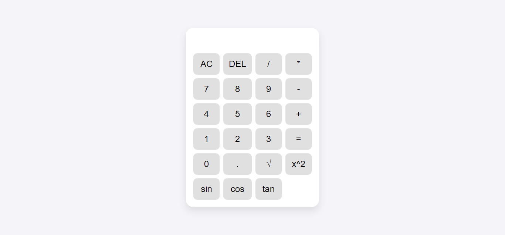

# iOS-Style Calculator

A web-based calculator inspired by the iOS calculator design. This project is built using HTML, CSS, and JavaScript, featuring both basic and advanced mathematical functions. Additionally, it keeps a history of all calculations performed.

## Features

- **Basic Operations**: Addition, Subtraction, Multiplication, Division
- **Advanced Operations**: Square root, Power, Trigonometric functions (sin, cos, tan)
- **History**: Tracks and displays a history of all calculations

## Project Structure

- `index.html` - The main HTML file containing the structure of the calculator.
- `style.css` - The CSS file for styling the calculator.
- `script.js` - The JavaScript file for handling calculator functionality.

## Installation

To run the calculator locally, follow these steps:

1. Clone this repository:
    ```bash
    git clone https://github.com/Uukow/ios-Calculator.git
    ```

2. Navigate to the project folder:
    ```bash
    cd ios-calculator
    ```

3. Open the `index.html` file in your web browser.

## How to Use

- **Basic Operations**: Click the buttons to input numbers and operators. Click `=` to evaluate.
- **Advanced Operations**: Use the additional buttons for square root, power, and trigonometric functions.
- **History**: View the history of your calculations above the display area.


## Screenshots



## Technologies Used

- HTML5
- CSS3
- JavaScript (ES6)

## Contributing

Contributions are welcome! Feel free to fork this repository and submit a pull request with your improvements.

1. Fork the project.
2. Create your feature branch (`git checkout -b feature/AmazingFeature`).
3. Commit your changes (`git commit -m 'Add some AmazingFeature'`).
4. Push to the branch (`git push origin feature/AmazingFeature`).
5. Open a pull request.

## License

This project is licensed under the MIT License - see the [LICENSE](https://facebook.com/uukow2017) file for details.

## Development by Abdulkadir Uukow